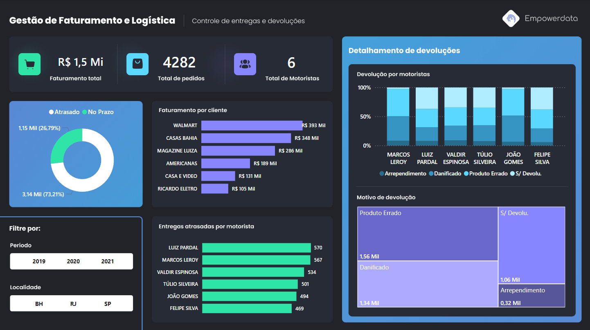

# Logistics Dashboard

## 📖 Descrição

O **Logistics Dashboard** é uma solução completa para análise e tratamento de dados logísticos, fornecendo insights valiosos para a tomada de decisões. O projeto segue o processo **ETL** (Extrair, Transformar e Carregar) para combinar dados de várias fontes, tratar informações e carregá-las em um formato adequado para análise. Além disso, inclui um dashboard em Power BI para visualizações interativas, facilitando o acompanhamento do desempenho logístico.

## 🚀 Funcionalidades

* **ETL (Extrair, Transformar e Carregar)** : Processa e prepara dados de forma eficiente, extraindo, transformando e carregando os dados necessários para análise.
* **Conversão de Datas** : Normaliza colunas de datas para o formato `datetime`.
* **Formatação de Valores Monetários** : Ajusta valores faturados para o formato brasileiro com vírgulas e arredonda para 2 casas decimais.
* **Separação de Dados** : Divide a coluna "Cliente - Motorista" em duas colunas distintas: **Cliente** e  **Motorista** .
* **Cálculo de Métricas** :
   * **Atraso (dias)** : Diferença entre a data de entrega prevista e a data de entrega real.
   * **Entrega no Prazo** : Identifica se a entrega foi feita dentro do prazo ou não.
* **Dashboard Interativo** : Dashboard em Power BI para visualização e análise de dados processados.

## 📂 Estrutura do Projeto

<pre class="!overflow-visible"><code class="!whitespace-pre hljs language-bash">root
├── dados/
│   ├── brutos/
│   │   └── BD_Logistica.csv  # Arquivo bruto de entrada
│   ├── tratados/
│       └── logistica.csv     # Arquivo tratado de saída
├── relatorios/
│   └── logistica_dashboard.pbix  # Dashboard em Power BI
├── src/
│   └── etl_db_logistica.py     # Script de processo ETL (extrair, transformar e carregar)
├── requirements.txt            # Arquivo com dependências do projeto
└── README.md                   # Documentação do projeto
</code></pre>

## 🛠️ Tecnologias Utilizadas

* **Python** :
* [pandas](): Manipulação e análise de dados.
* [os](https://docs.python.org/3/library/os.html): Manipulação de diretórios e arquivos.
* **Power BI** :
* Dashboard interativo para análise de dados e suporte à tomada de decisões.
* **Estrutura de Arquivos** :
* CSV para entrada e saída de dados.
* PBIX para visualizações analíticas.

## 📝 Como Configurar e Executar

1. Clone o repositório:
   <pre class="!overflow-visible"><code class="!whitespace-pre hljs language-bash">git clone https://github.com/Renanfls/Logistics_Dashboard.git
   cd Logistics_Dashboard
   </code></pre>
2. Instale as dependências do projeto:
   <pre class="!overflow-visible"><code class="!whitespace-pre hljs language-bash">pip install -r requirements.txt
   </code></pre>
3. Certifique-se de que o arquivo de entrada (`BD_Logistica.csv`) esteja no diretório `dados/brutos/`.
4. Execute o script **ETL** para processar os dados:
   <pre class="!overflow-visible"><code class="!whitespace-pre hljs language-bash">python src/etl_db_logistica.py
   </code></pre>
5. Verifique os dados tratados no diretório `dados/tratados/`, no arquivo `logistica.csv`.
6. Abra o arquivo `relatorios/logistica_dashboard.pbix` no Power BI para explorar o dashboard interativo.

## 📊 Dashboard em Power BI

O arquivo `logistica_dashboard.pbix` na pasta `relatorios` contém um painel interativo que permite:

* Visualizar KPIs como **taxa de entregas no prazo** e  **faturamento total** .
* Identificar atrasos em entregas e seus impactos.
* Realizar análises detalhadas por cliente, motorista ou período.
* Apoiar decisões estratégicas com base nos dados tratados e normalizados.

## 📧 Contato

Para dúvidas ou sugestões:

* **Autor** : Renan Fabricio
* **Email** : contato.renanfabricio@gmail.com
